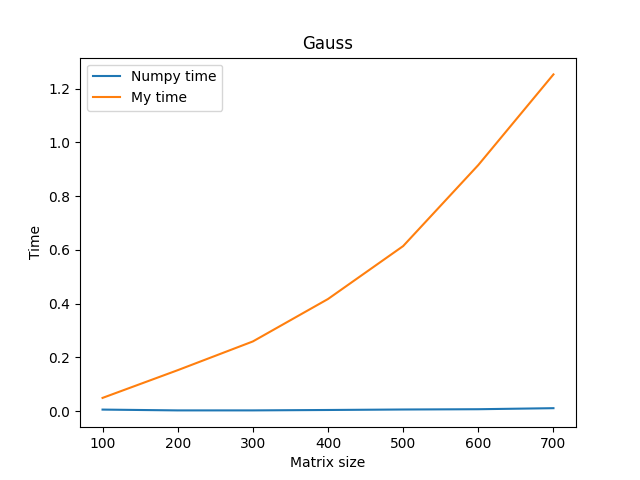
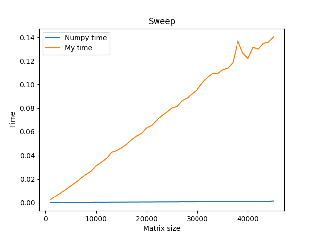

# HOMEWORK1: Gauss method, Cholesky method, Sweep method
## Gauss method
It is solving linear system of equations by Gauss method.
### Launch
```bash
python3 gauss.py
```
Input N, where N will be count of iterations, (N * 100) will be sizes of matrix, and wait result.
### Result

## Cholesky method
It is solving linear system of equations by Cholesky method.
### Launch
```bash
python3 holeckiy.py
```
Input N, where N will be count of iterations, (N * 100) will be sizes of matrix, and wait result.
### Result

## Sweep method
It is solving linear system of equations by Sweep method.
### Launch
```bash
python3 sweep.py
```
Input N, where N will be count of iterations, (N * 1000) will be sizes of matrix, and wait result.
### Result



