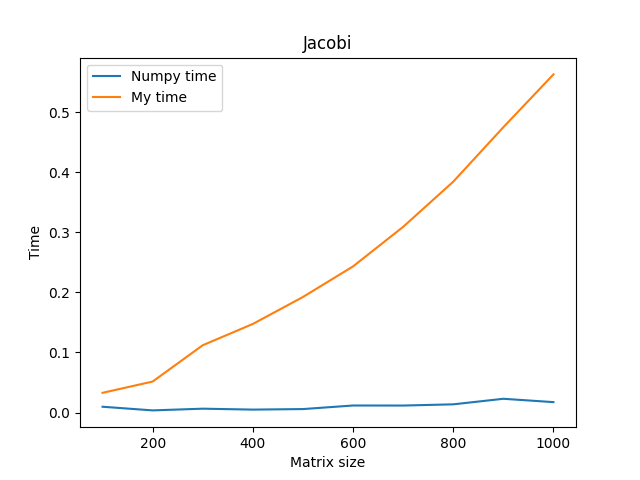
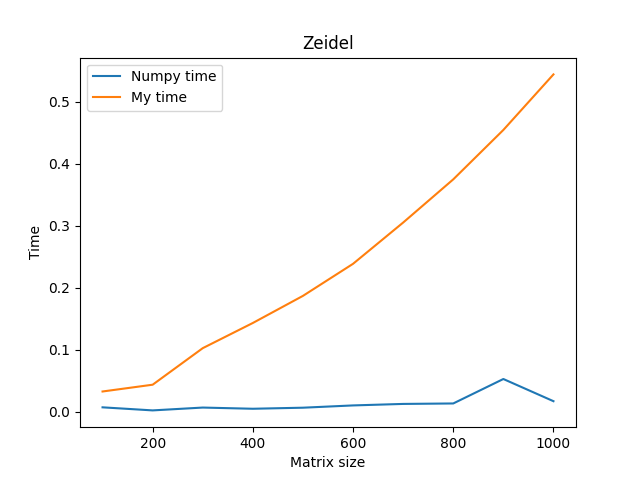
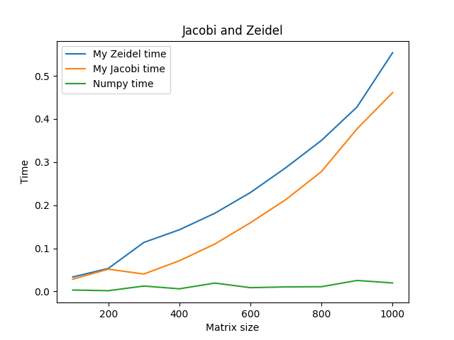

# HOMEWORK1: Jacobi method, Zeidel method, Jacobi and zeidel methods to compare with numpy
## Jacobi method
It is solving linear system of equations by Gauss method.
### Launch
```bash
python3 jacobi.py
```
Input N, where N will be count of iterations, (N * 100) will be sizes of matrix, and wait result.
### Result

## Zeidel method
It is solving linear system of equations by Zeidel method.
### Launch
```bash
python3 zeidel.py
```
Input N, where N will be count of iterations, (N * 100) will be sizes of matrix, and wait result.
### Result

## Jacobi and Zeidel methods to compare with numpy
It is solving linear system of equations by Jacobi, Zeidel and Numpy methods to compare.
### Launch
```bash
python3 combo.py
```
Input N, where N will be count of iterations, (N * 100) will be sizes of matrix, and wait result.
### Result

