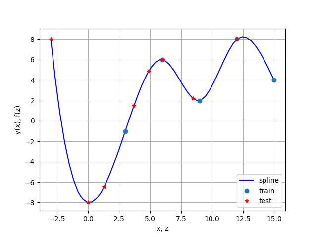

# HOMEWORK3: Linear interpolation and Lagrange interpolation on uneven grid, Spline interpolation on uniform grid
## Linear interpolation on uneven grid
It is performing linear interpolation on uneven grid.
### Launch
```bash
python3 31.py
```
data1/train.dat - input  data x<sub>0</sub> < x<sub>1</sub> < ... < x<sub>n</sub>;<br/>
data1/train.ans - input  data y<sub>0</sub>, y<sub>1</sub>, ..., y<sub>n</sub>;<br/>
data1/test.dat  - input  data z<sub>0</sub>, z<sub>1</sub>, ..., z<sub>m</sub>.
### Result
data1/test.ans  - output data f<sub>0</sub>, f<sub>1</sub>, ..., f<sub>m</sub><br/>

## Lagrange interpolation on uneven grid
It is performing lagrange interpolation on uneven grid.
### Launch
```bash
python3 32.py
```
data2/train.dat - input  data x<sub>0</sub> < x<sub>1</sub> < ... < x<sub>n</sub>;<br/>
data2/train.ans - input  data y<sub>0</sub>, y<sub>1</sub>, ..., y<sub>n</sub>;<br/>
data2/test.dat  - input  data z<sub>0</sub>, z<sub>1</sub>, ..., z<sub>m</sub>.
### Result
data2/test.ans  - output data f<sub>0</sub>, f<sub>1</sub>, ..., f<sub>m</sub><br/>

## Spline interpolation on uniform grid
It is performing spline interpolation on uniform grid.
### Launch
```bash
python3 33.py
```
It is guaranteed x<sub>i</sub> is uniform grid.<br/>
data3/train.dat - input  data x<sub>0</sub> < x<sub>1</sub> < ... < x<sub>n</sub>;<br/>
data3/train.ans - input  data y<sub>0</sub>, y<sub>1</sub>, ..., y<sub>n</sub>;<br/>
data3/test.dat  - input  data z<sub>0</sub>, z<sub>1</sub>, ..., z<sub>m</sub>.
### Result
data3/test.ans  - output data f<sub>0</sub>, f<sub>1</sub>, ..., f<sub>m</sub><br/>



