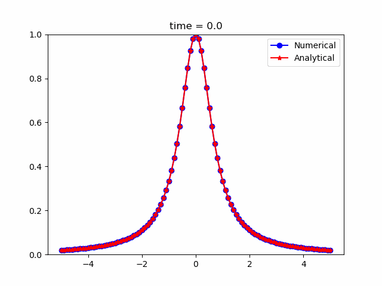

# HOMEWORK4: Transfer and Heat equation
## Transfer Equation
It is solving of the transfer equation.
### Launch
```bash
python3 transf_eq.py
```
Input n, m, push enter and wait result.
### Result animation

## Heat Equation
It is solving of the heat equation.
### Launch
```bash
python3 heat_eq.py
```
Input n, m, push enter and wait result.
### Result animation

